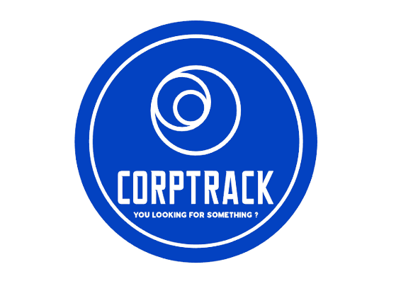

# CorpTrack
<a name="readme-top"></a>

[![Contributors][contributors-shield]][contributors-url]
[![Forks][forks-shield]][forks-url]
[![Stargazers][stars-shield]][stars-url]
[![Issues][issues-shield]][issues-url]

<!-- PROJECT LOGO -->
<br />
<div align="center">
  <a href="https://github.com/nico-vrn/CorpTrack">
    
  </a>

  <h3 align="center">CorpTrack</h3>

  <p align="center">
    Site d'information et de recherche de vulnérabilités sur les entreprises française 
    <br />
   </p>
</div>

## Prérequis

- Node.js installé (version recommandée : 14.x ou supérieure)
- Un éditeur de code tel que Visual Studio Code

## Installation

1. Clonez le dépôt git :
```sh
git https://github.com/nico-vrn/CorpTrack
```

2. Accédez au dossier du projet :
```sh
cd CorpTrack
```

3. Installez les dépendances du projet :
```sh
npm install
```

## Utilisation

1. Démarrez le serveur de développement local avec Express :
```sh
node server.js
```

Le serveur devrait démarrer sur `http://localhost:3000`.

2. Ouvrez votre navigateur et accédez à `http://localhost:3000`.

## Fonctionnalités principales

- Liste des fonctionnalités principales de votre projet.

## Contribution

Les contributions sont les bienvenues ! Pour contribuer, suivez les étapes suivantes :

1. Forkez le dépôt.
2. Créez une nouvelle branche avec un nom descriptif pour votre fonctionnalité ou correctif.
3. Faites vos modifications et soumettez-les avec un commit.
4. Créez une pull request vers la branche `main` du dépôt d'origine.

##Dependances:

API utilisés :
- API recherche d'entreprise [API gouv](https://api.gouv.fr/documentation/api-recherche-entreprises)
- API shodan [API shodan](https://developer.shodan.io/api) 
- API NVD [API NVD](https://nvd.nist.gov/developers/vulnerabilities)

## Auteurs

- Lefranc Nicolas, [@nico-vrn](https://github.com/nico-vrn)
- Gigon Le GrainAlix, [alixxila](https://github.com/alixxila)
- Montanari Aurélien, [aurmtnr](https://github.com/aurmtn)

## Licence

Ce projet est sous licence MIT - voir le fichier [LICENSE](LICENSE) pour plus de détails.


<!-- MARKDOWN LINKS & IMAGES -->
<!-- https://www.markdownguide.org/basic-syntax/#reference-style-links -->
[contributors-shield]: https://img.shields.io/github/contributors/nico-vrn/CorpTrack?style=for-the-badge
[contributors-url]: https://github.com/nico-vrn/CorpTrack/graphs/contributors
[forks-shield]: https://img.shields.io/github/forks/nico-vrn/CorpTrack.svg?style=for-the-badge
[forks-url]: https://github.com/nico-vrn/CorpTrack/network/members
[stars-shield]: https://img.shields.io/github/stars/nico-vrn/CorpTrack.svg?style=for-the-badge
[stars-url]: https://github.com/nico-vrn/CorpTrack/stargazers
[issues-shield]: https://img.shields.io/github/issues/nico-vrn/CorpTrack.svg?style=for-the-badge
[issues-url]: https://github.com/nico-vrn/CorpTrack/issues
